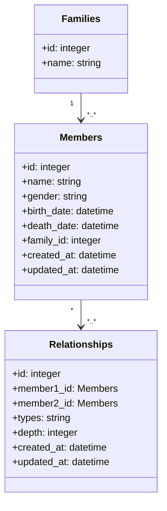

# Family Tree Management System
## System Design
### Problem
  On the planet of Lengaburu, the distant galaxy of Tara B. Our protagonists are King Arthur, Queen Margaret and their family. King Arthur is the emperor of Lengaburu and has been ruling the planet for the last 350 years (they have long lives in Lengaburu!). Let’s write some code to get to know the family.
### Solution
#### Functional
1. Add Families: Users can add families with attribute name.
2. Add Family Members: Users can add family members with details such as name, birth date, gender, and other optional attributes.
3. Define Relationships: Users can establish relationships (e.g., parent, child, spouse, sibling) between family members.
4. View Family Tree: Display the family tree visually, allowing users to see relationships and family structure.
5. Edit Member Details: Update information about each family member (e.g., edit birth dates, add death dates, or modify relationships).
6. Search and Filter: Allow users to search for a specific family member by name and filter by attributes like age.
7. Import/Export: Enable users to import family data from other sources (e.g., pdf files) and export the family tree as images or files.

#### Class Diagram

#### API Design
1. Family Management
  - `POST /families`: Add a new family.
  - `GET /families`: Retrieve all families.
  - `GET /families/{id}`: Retrieve details of a specific family.
  - `PUT /families/{id}`: Update information about a family.
  - `DELETE /families/{id}`: Remove a family.
2. Family Members Management
  - `POST /members`: Add a new family member.
  - `GET /members`: Retrieve all family members.
  - `GET /members/{id}`: Retrieve details of a specific family member.
  - `PUT /members/{id}`: Update information for a family member.
  - `DELETE /members/{id}`: Remove a family member.
3. Relationships Management
 - `POST /relationships`: Define a relationship between two members.
 - `GET /members/{id}/relationships`: Retrieve relationships of a specific member.
 - `DELETE /relationships/{id}`: Remove a relationship.
4. Family Tree Visualization
 - `GET /trees/{id}`: Retrieve a full view of a family tree structure.
5. Search and Filter:
- `GET /members/search`: Search family members by name or other attributes.
- `GET /members/filter`: Filter family members based on attributes like age or location.
6. Import and Export
- `POST /trees/import`: Import family data.
- `GET /trees/{id}/export`: Export the family tree to a file format (PDF).
